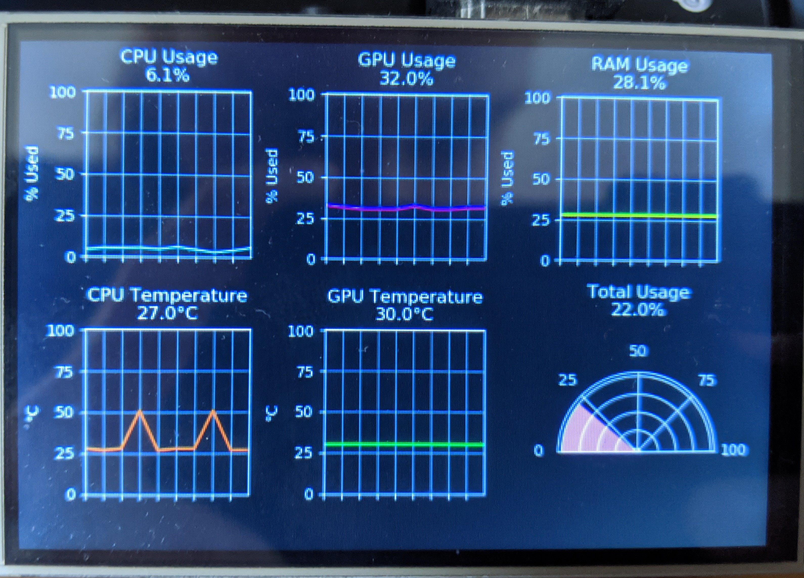

# hardware-monitor
Python project to process and display live graphs of hardware usage information logged by MSI Afterburner

The aim of this project was to produce a series of graphs showing some hardware usage and temperatures on a small monitor to be mounted inside my PC. 
